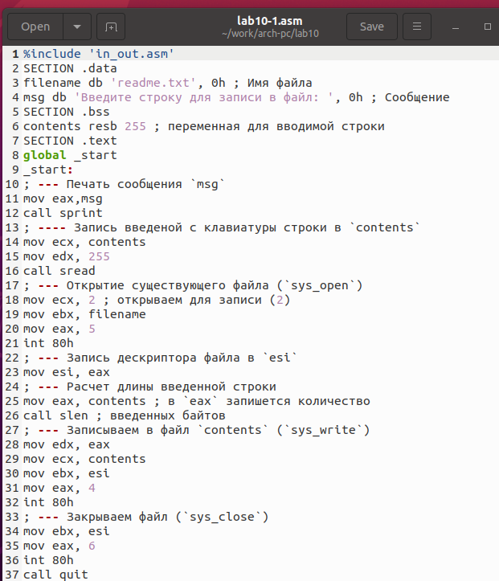
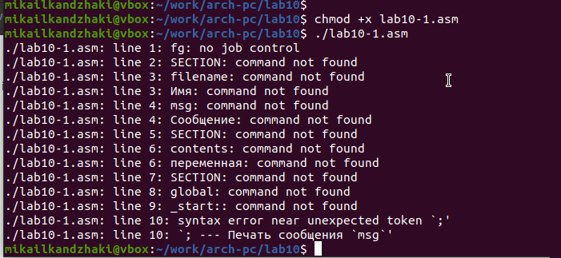
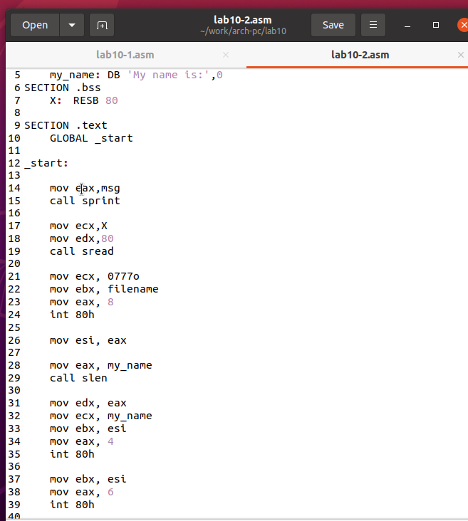

---
## Front matter
title: "Отчёт по лабораторной работе 10"
subtitle: "Архитектура компьютеров"
author: "Кандакжи Микаил Халидович"

## Generic otions
lang: ru-RU
toc-title: "Содержание"

## Bibliography
bibliography: bib/cite.bib
csl: pandoc/csl/gost-r-7-0-5-2008-numeric.csl

## Pdf output format
toc: true # Table of contents
toc-depth: 2
lof: true # List of figures
lot: true # List of tables
fontsize: 12pt
linestretch: 1.5
papersize: a4
documentclass: scrreprt
## I18n polyglossia
polyglossia-lang:
  name: russian
  options:
	- spelling=modern
	- babelshorthands=true
polyglossia-otherlangs:
  name: english
## I18n babel
babel-lang: russian
babel-otherlangs: english
## Fonts
mainfont: PT Serif
romanfont: PT Serif
sansfont: PT Sans
monofont: PT Mono
mainfontoptions: Ligatures=TeX
romanfontoptions: Ligatures=TeX
sansfontoptions: Ligatures=TeX,Scale=MatchLowercase
monofontoptions: Scale=MatchLowercase,Scale=0.9
## Biblatex
biblatex: true
biblio-style: "gost-numeric"
biblatexoptions:
  - parentracker=true
  - backend=biber
  - hyperref=auto
  - language=auto
  - autolang=other*
  - citestyle=gost-numeric
## Pandoc-crossref LaTeX customization
figureTitle: "Рис."
tableTitle: "Таблица"
listingTitle: "Листинг"
lofTitle: "Список иллюстраций"
lotTitle: "Список таблиц"
lolTitle: "Листинги"
## Misc options
indent: true
header-includes:
  - \usepackage{indentfirst}
  - \usepackage{float} # keep figures where there are in the text
  - \floatplacement{figure}{H} # keep figures where there are in the text
---

# Цель работы

Целью работы является приобретение навыков написания программ для работы с файлами.

# Выполнение лабораторной работы

Я создал каталог для лабораторной работы № 10 и перешел в него. 
В этом каталоге я создал три файла: lab10-1.asm, readme-1.txt и readme-2.txt.

В файле lab10-1.asm я написал программу из листинга 10.1, которая записывает 
сообщение в файл. Затем я создал исполняемый файл 
из этого кода и проверил его работу.(рис. [-@fig:001])

{ #fig:001 width=70%, height=70% }

Программа запрашивает строку и перезаписывает ее в файл readme.txt. 
Если файл не существует, строка не будет записана никуда.(рис. [-@fig:002])

{ #fig:002 width=70%, height=70% }

Чтобы запретить выполнение исполняемого файла lab10-1, я использовал команду chmod для изменения прав доступа. Я снял атрибут "x" во всех трех позициях. 
После этого я попытался выполнить файл.

Однако файл не запускается, потому что выполнение запрещено 
из-за отсутствия атрибута "x" во всех трех позициях. (рис. [-@fig:003])

{ #fig:003 width=70%, height=70% }

Я изменил права доступа к файлу lab10-1.asm, добавив права на выполнение с помощью команды chmod. 
Затем я попытался выполнить файл.(рис. [-@fig:004])

В результате, файл запустился, и терминал попытался выполнить его содержимое 
как команды командной строки. Однако, так как это файл с кодом на языке ассемблера, 
а не команды терминала, возникли ошибки. Тем не менее, если в такой файл добавить команды командной строки, то можно будет выполнить эти команды, запустив файл.

{ #fig:004 width=70%, height=70% }

Далее, я установил права доступа к файлам readme в соответствии с 
указанными вариантом в таблице 10.4. Чтобы проверить правильность выполнения, 
я использовал команду ls -l. (рис. [-@fig:005])

для варианта 13: ```-w- --x ---``` ```110 011 001```

{ #fig:005 width=70%, height=70% }

## Задание для самостоятельной работы

Написал программу работающую по следующему алгоритму (рис. [-@fig:006]) (рис. [-@fig:007]):

* Вывод приглашения “Как Вас зовут?”

* ввести с клавиатуры свои фамилию и имя

* создать файл с именем name.txt

* записать в файл сообщение “Меня зовут”

* дописать в файл строку введенную с клавиатуры

* закрыть файл

{ #fig:006 width=70%, height=70% }

{ #fig:007 width=70%, height=70% }

# Выводы

Освоили работy с файлами и правами доступа.